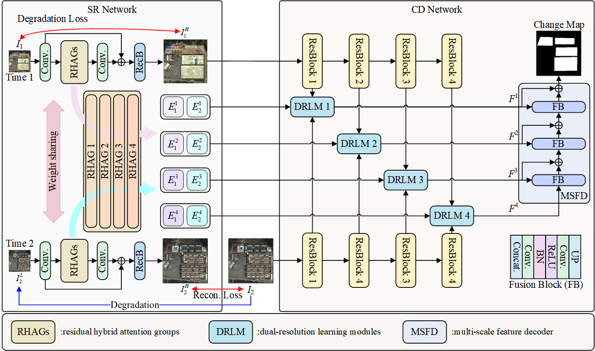
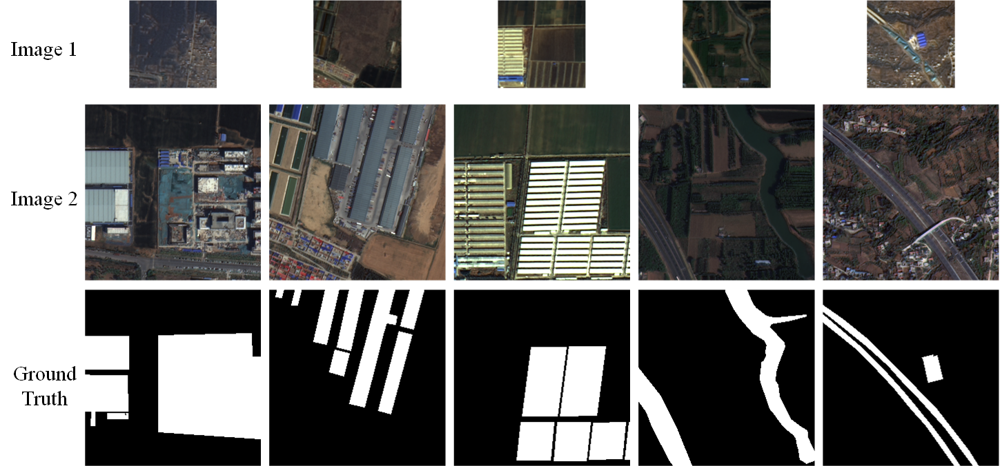

# DRJL-Net

**Paper:** *Towards Cross-Satellite Change Detection: A Dual-Resolution Joint Learning Network*  
**Authors:** Kai Zhang, Jian Xiao, Feng Zhang, Jiande Sun, Lorenzo Bruzzone

<p align="center">
  
</p>

> DRJL-Net integrates **LR features** from a super-resolution (SR) network and **HR features** from a change detection (CD) network, and further suppresses cross-satellite **spectral/spatial discrepancies** via dual-resolution learning modules (DRLMs).

# SD-CSCD dataset

SD-CSCD is a remote sensing change detection dataset composed of bi-temporal images acquired by different satellites, designed to study change detection under cross-satellite settings.

<p align="center">
  
</p>

### Dataset Description
- **Region:** Shandong Province, China (urban expansion, infrastructure, land-use transformation)
- **Satellites / Time:**
  - **Time 1 (pre-event):** GF-6, **2 m** resolution, acquired in **2019**
  - **Time 2 (post-event):** GF-2, **1 m** resolution, acquired in **2024**
  - Resolution ratio **r = 2**
- **Bands used:** **RGB only** (R/G/B). *(Note: original multispectral data includes NIR, but RGB is used for better matching with existing networks.)*
- **Patch sizes:**
  - Time 1 (GF-6): **128×128**
  - Time 2 (GF-2): **256×256**
- **Scale:** **3,640** paired patches, split into **train/val/test = 7:1:2**
- **Preprocessing:** radiometric calibration, atmospheric correction, orthorectification, RPC-based refinement, pansharpening (ENVI NNDiffuse), co-registration, patch cropping, labeling.

### Directory Structure (Example)
```text
SD-CSCD/
  train/
    T1/
    T2/
    label/
val/
    T1/
    T2/
    label/
  test/
    T1/
    T2/
    label/
The link of Google griver:https://drive.google.com/file/d/1c914-34fuf8vmwMwK0ZrsO_KytwyM1QS/view?usp=drive_link

The dataset is avaliable at：https://pan.baidu.com/s/1kfJ6DDhKGRRwdr2AjvvDgg?pwd=2358
